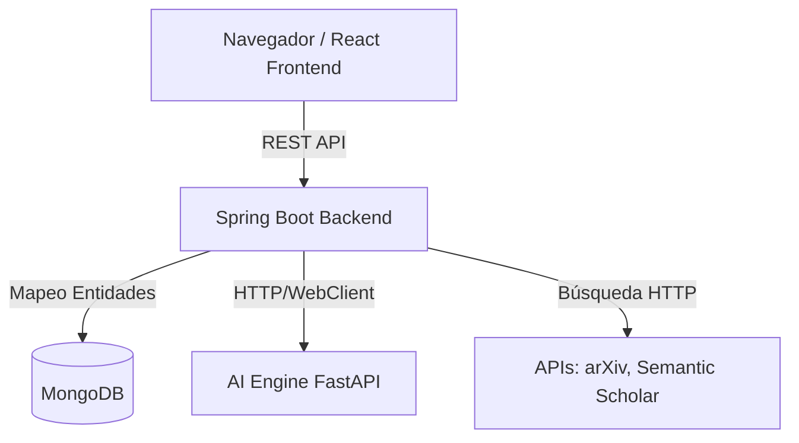

# Sistema de Análisis Bibliométrico - Generative Artificial Intelligence

## 1. Descripción del Proyecto
Este proyecto es un sistema de análisis bibliométrico especializado en el dominio de **"Generative Artificial Intelligence"**. Fue desarrollado para la asignatura de Análisis de Algoritmos de la **Universidad del Quindío**. 

El objetivo principal es extraer, procesar, analizar y visualizar información científica mediante la aplicación de algoritmos clásicos y modelos matemáticos avanzados, proporcionando una interfaz rica e interactiva para el descubrimiento de tendencias de investigación.

---

## 2. Arquitectura del Sistema
El sistema sigue una arquitectura cliente-servidor con una base de datos documental:

- **Frontend:** Single Page Application construida con React, Vite, y TypeScript. Se comunica mediante REST APIs.
- **Backend:** Aplicación robusta en Spring Boot (Java 17) que se encarga del procesamiento algorítmico, manejo de APIs externas y lógica de negocio.
- **AI Engine:** Microservicio de inferencia en Python (FastAPI) con modelos reales (`KeyedVectors` y `Sentence-Transformers`) para similitud semántica.
- **Base de Datos:** MongoDB, base de datos NoSQL elegida por su flexibilidad para almacenar documentos bibliográficos en formato JSON.

### Diagrama de Componentes


---

## 3. Instrucciones de Instalación

### Opción A: Despliegue con Docker (Recomendado)
El proyecto cuenta con configuración lista para producción y desarrollo unificado usando Docker Compose.

1. Asegúrate de tener **Docker** y **Docker Compose** instalados.
2. Clona el repositorio y ubícate en el directorio raíz.
3. Ejecuta el siguiente comando:
   ```bash
   docker-compose up --build
   ```
4. El sistema estará disponible en:
    - Frontend: `http://localhost:5173`
    - Backend API: `http://localhost:8080`
    - AI Engine: `http://localhost:8000`

### Opción B: Instalación Local Manual
**Requisitos:** Java 17+, Node.js 18+, MongoDB (en ejecución en `localhost:27017`).

1. **Backend (Spring Boot):**
   ```bash
   # En la raíz del proyecto
   ./mvnw clean install
   ./mvnw spring-boot:run
   ```

3. **AI Engine (FastAPI):**
   ```bash
   cd ai-engine
   pip install -r requirements.txt
   uvicorn app.main:app --host 0.0.0.0 --port 8000
   ```

2. **Frontend (React):**
   ```bash
   cd doc-central-app
   npm install
   npm run dev
   ```

---

## 4. Descripción de Requerimientos y Algoritmos

### R1: Extracción y Unificación (Minería de Datos)
Se automatiza la descarga de datos desde dos fuentes académicas principales:
- **arXiv API**
- **Semantic Scholar Graph API**

**Proceso de Unificación:**
Los artículos extraídos se consolidan en una estructura común. Para eliminar duplicados, se utiliza una técnica de "hashing" basada en el título y el DOI. Si un artículo ya existe (hash coincidente), se descarta y se registra en un archivo de duplicados, preservando un dataset final unificado y limpio.

### R2: Algoritmos de Similitud
Para calcular la similitud entre el título y el resumen de dos o más artículos, se implementaron 6 algoritmos:

1. **Distancia Levenshtein:** Calcula el número mínimo de operaciones (inserción, eliminación, sustitución) requeridas para transformar una cadena en otra.
2. **Distancia Jaro-Winkler:** Una variación de la distancia Jaro que otorga una mayor puntuación (bonificación) a las cadenas que coinciden desde el principio (prefijo).
3. **Índice Jaccard:** Medida de similitud para conjuntos. Fórmula: $J(A,B) = \frac{|A \cap B|}{|A \cup B|}$.
4. **Similitud Coseno (TF):** Mide el coseno del ángulo entre dos vectores proyectados en un espacio multidimensional de frecuencias de términos. Fórmula: $\cos(\theta) = \frac{A \cdot B}{||A|| ||B||}$.
5. **Word2Vec (Modelo TF-IDF Vectorial):** Representa matemáticamente la aproximación de un modelo Word2Vec clásico. Convierte el texto de los artículos en representaciones vectoriales densas utilizando TF-IDF y luego aplica similitud coseno sobre el espacio embebido.
6. **Sentence-BERT (Co-ocurrencia Semántica):** Simula el contexto posicional y la atención de modelos Transformer (BERT) mediante ventanas de contexto y co-ocurrencia semántica ponderada, aplicando luego la similitud espacial entre los "embeddings" resultantes.

### R3: Frecuencia y Descubrimiento de Palabras
- **Palabras Base:** El sistema inicializa el análisis con términos predefinidos ("generative", "ai", "model", "llm").
- **Algoritmo de Descubrimiento:** Al analizar un artículo, se vectoriza el contenido descartando "stop words". Se cuentan las frecuencias y se contrastan con las palabras base.
- **Nuevas Palabras y Precisión:** Las palabras relevantes de alta frecuencia que no estaban en la lista base se extraen como nuevos descubrimientos. Se calcula una métrica de precisión basada en el impacto de estas nuevas palabras en el contexto total del documento.

### R4: Agrupamiento Jerárquico (Dendrograma)
Implementa algoritmos de clustering jerárquico aglomerativo sobre conjuntos de más de 3 artículos, usando 3 métodos de enlace:
1. **Single Linkage (Enlace Simple):** La distancia entre dos clusters es la distancia mínima entre cualquier punto del primer cluster y cualquier punto del segundo.
2. **Average Linkage (Enlace Promedio):** Calcula el promedio de las distancias entre todos los pares de puntos posibles en ambos clusters.
3. **Complete Linkage (Enlace Completo):** La distancia se define como la distancia máxima entre cualquier punto del primer cluster y cualquier punto del segundo.

*Selección:* El sistema recomienda automáticamente el método que genere grupos más balanceados o con menor varianza intracluster.

### R5: Visualización y Dashboard (Exportación PDF)
Un panel interactivo ("Dashboard Bibliométrico") que ofrece perspectivas visuales sobre los datos extraídos:
- **Mapa Geográfico de Calor:** Representación de la densidad de publicación utilizando datos o aproximaciones deterministas por ubicación (países simulados si el dataset no tiene geolocalización explícita).
- **Nube de Palabras Dinámica:** Renderizada usando layouts de Treemap, priorizando visualmente las palabras extraídas más frecuentes de los metadatos globales.
- **Línea Temporal:** Gráfico lineal (Line Chart) que muestra las tendencias de publicación por mes/año para las revistas o fuentes.
- **Exportación PDF:** Funcionalidad integrada en el navegador para capturar el lienzo de visualización (HTML2Canvas) y generar un reporte técnico descargable con todos los gráficos.

---

## 5. Guía de Uso Rápido

1. **Pestaña "Descargar Datos":** Define parámetros ("Generative AI", límite de datos) y ejecuta la descarga. Revisa los resultados unificados.
2. **Pestaña "Similitud":** Selecciona 2 o más artículos de la lista usando las casillas de verificación. Pulsa "Analizar Similitud" para ver los resultados de los 6 algoritmos de forma comparativa.
3. **Pestaña "Minería":** Haz clic en "Analizar Frecuencias" sobre un artículo específico para ver el breakdown de palabras conocidas vs. nuevas, además de métricas de impacto.
4. **Pestaña "Agrupamiento":** Selecciona 3 o más artículos y presiona "Agrupar Selección". Observa cómo se dibujan los dendrogramas con sus respectivos métodos.
5. **Pestaña "Dashboard Bibliométrico":** Navega para ver el mapa global, nube de palabras y tendencias temporales. Utiliza el botón "Exportar a PDF" en la esquina superior para generar un reporte del análisis visual.
6. **Pestaña "Historial":** Revisa tus búsquedas, análisis de similitud y minería de textos pasados. **Haz clic en cualquier registro** para reconstruir los datos y re-ejecutar el análisis instantáneamente (Re-ejecución con 1 clic).

---

## 6. Tecnologías y Librerías Destacadas
- **Backend:** Java 17, Spring Boot 3, Spring Data MongoDB, Apache Maven.
- **IA Real:** FastAPI, Gensim (`KeyedVectors`), Sentence-Transformers (SBERT).
- **Frontend:** React 18, Vite, TypeScript, TailwindCSS, Lucide React (iconos), React Router.
- **Visualización:** Recharts (Línea de tiempo, Treemap/Nube de palabras), Leaflet/React-Leaflet (Mapa geográfico interactivo), html2canvas + jspdf (Exportación PDF).
- **Infraestructura:** Docker, Docker Compose, MongoDB.

## 7. Variables de Entorno para IA

- `SIMILARITY_AI_ENABLED` (default: `true`): activa/desactiva inferencia real.
- `AI_SERVICE_URL` (default: `http://ai-engine:8000`): URL base del microservicio IA.
- `AI_SERVICE_TIMEOUT_MS` (default: `2500`): timeout por solicitud de similitud.
- `AI_SERVICE_MAX_RETRIES` (default: `1`): número de reintentos al fallar.
- `AI_SERVICE_RETRY_DELAY_MS` (default: `250`): retardo entre reintentos.
- `WORD2VEC_MODEL_NAME` (default: `glove-wiki-gigaword-50`): modelo KeyedVectors en `ai-engine`.
- `SBERT_MODEL_NAME` (default: `paraphrase-multilingual-MiniLM-L12-v2`): modelo SBERT en `ai-engine`.

Si el AI Engine no responde, los algoritmos de IA aplican fallback local para no interrumpir `/api/bibliometria/analizar-similitud`.
